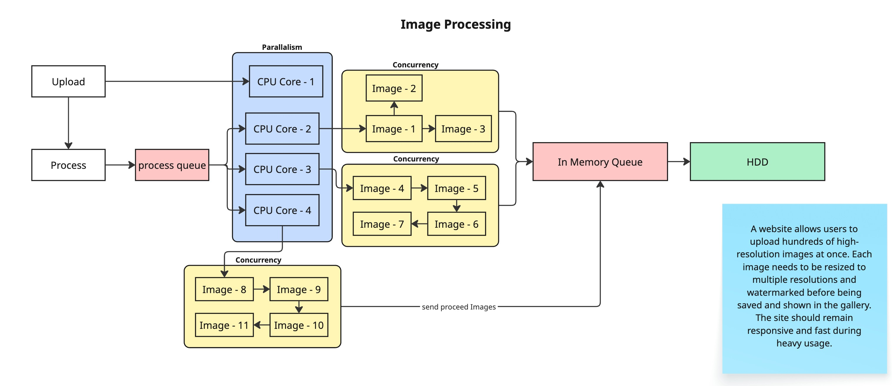

**Bulk Image Processing for a Photography Website**

A website allows users to upload hundreds of high-resolution images at once. Each image needs to be resized to multiple resolutions and watermarked before being saved and shown in the gallery. The site should remain responsive and fast during heavy usage.

**_Workflow_**

Upload Images on first dedicated cpu core -> get cpu number and open set thread for each queue -> open processImage queue & saveImage queue -> push one by one image to processImage queue -> after process completed -> close process queue -> after save on HDD close save queue -> return result.
